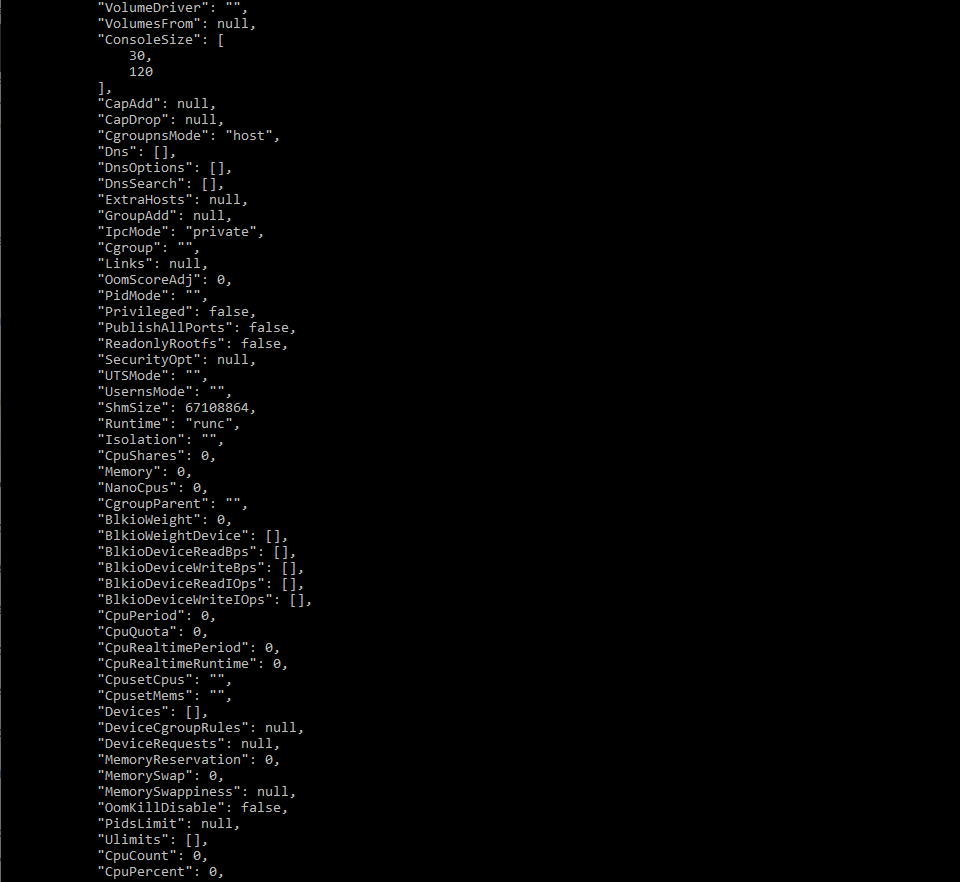
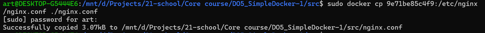

# Отчет о выполнении проекта Simple Docker (DO5)

- [Отчет о выполнении проекта Simple Docker (DO5)](#отчет-о-выполнении-проекта-simple-docker-do5)
  - [Part 1. Готовый докер](#part-1-готовый-докер)
  - [Part 2. Операции с контейнером](#part-2-операции-с-контейнером)
  - [Part 3. Мини веб-сервер](#part-3-мини-веб-сервер)
  - [Part 4. Свой докер](#part-4-свой-докер)
  - [Part 5. Dockle](#part-5-dockle)
  - [Part 6. Базовый Docker Compose](#part-6-базовый-docker-compose)

## Part 1. Готовый докер

- ***Проверка установки docker*** \

- ***Скачиваем образ nginx*** \

В данном случае скачивается образ с тегом latest.

- ***Проверяем наличие скачанного образа nginx*** \

- ***Запускаем образ nginx (по id образа) и проверка запуска процесса*** \

- ***Вывод docker inspect*** \
 \
 \
 \
 \

Размер образа составляет 187 MB \
Замапленые порты 80/tcp \
IP адрес 172.17.0.2

- ***Останавливаем работку контейнера nginx (по id образа) и проверка остановки*** \

- ***Запускаем контенер nginx с мапингом на портыы 80 и 443*** \

- ***Проверяем доступность nginx по порту 80*** \
 \
Ввиду запуска контенера на WSL доступ осществляется по ip-адресу виртуальной машины.

- ***Перезапускаем контейнер и проверяем, что он перезапустился*** \

## Part 2. Операции с контейнером

- ***Заходим внутрь исполняющегося контейнера*** \

- ***Читаем содержимое nginx.conf в контейнере*** \

- ***Для изменения файла копируем его на хост*** \

- ***После изменения копируем файл в контейнер*** \

- ***Измененный файл (добавлен путь /status) имеет следующий вид (считано в контейнере)*** \
 \
 \
Измененный файл в проекте [nginx.conf](./nginx.conf)

- ***Так как nginx считывает конфигурацию оди раз при его запуске, перезапустим его что-бы применить сделанные настройки (выполняется внутри кнтейнера)*** \

- ***Проверяем, что все работает корректно*** \

- ***Экспортируем контейнер*** \

- ***Останавливаем работу контейнера*** \

- ***Удаляем образ nginx*** \
 \
Так как образ используется контейнером удаление прозводим с с ключом -f, который позволяет удалить образ принудительно. При этом убеждаемся что остановленный контейнер на месте. \

- ***Удаляем контейнер*** \

- ***Импортируем образ контейнера*** \
 \
Следует помнить, что команда **docker export** переносит только файловую структуру контейнера и не переносит настроенные переменные среды и запуска. В этой связи необходимо команду запуска прописывать при создании и запуске контейнера.

- ***Запускаем контейнер*** \
 \
параметры запуска можно подсмотреть выводе команды **docker inspect**, что выполнялся ранее.

- ***Проверяем работу*** \

*Проверить выполнение задания можно с помощью файла контейнера [container.tar](./container.tar)*

## Part 3. Мини веб-сервер

- ***Для начала создадим простое приложение FastCGI.  [fcgi_app.c](./fcgi-app.c)***

- ***Установим библиотеки необходимые для создания web-сервера*** \

- ***Собираем приложение.*** \
 \
*Укажем место хранения заголовочного файла (параметр -I) и расположение файла библиотеки (параметр -L).*

- ***Создаем новый контейнер*** \
При создании контейнера определяем маппинг порта 81 на котором булем взаимодействовать с веб сервером и приложением. \

- ***Проверяем работает ли контейнер*** \

- ***Копируем файл настроек nginx для FastCGI приложения*** \
 \
Файл настроек. [nginx.conf](./nginx-1.conf)

- ***Копируем исходный код FastCGI приложения*** \
 

- ***Обновляем содержимое списков репозитория*** \
 \
Необходимо что бы получить список обновленных версий приложений и утилит необходимых для установки.

- ***Устанавливаем необходимые компоненты*** \
 \
На данном этапе устанавливается: \
компилятор gcc, необходимый для сборки приложения \
библиотека libfcgi-dev (без нее приложение не скомпилируется) \
утилита spawn-fcgi

- ***Компилируем приложение*** \

- ***Запускаем приложение как удаленное с прослушиванием необходимого порта*** \
 \
параметр -p отвечает за назначение порта прослушивателя. Согласно заданию мы "вешаем" приложение на порт 8080.
Использование spawn-fcgi позволяет нам разместить приложение как на локальном, так и на удаленном сервере. При необходимости обновления и перезапуска приложение и nginx могут перезапускатьс отдельно друг от друга, т.е. перезапуск nginx при перезапуске приложения не потребуется.

- ***Рестартуем nginx*** \
 \
Необходимый шаг, что бы новые настройки из ранее скопированного файла вступили в силу. Прилоежение fcgi рестартовать при этом не требуется.

- ***Проверка результатов*** \
В консоли \
 \
\
В браузере \

Для проверки можно воспользоваться скриптом автоматизации [task3.sh](./task3.sh). (Запуск из под sudo)

## Part 4. Свой докер

- ***Создаем DOCKERFILE***
Данный файл содержит последовательность инструкций выполняя которые он собирает образ для последующего использования. [Dockerfile](./Dockerfile1)

Для исходника используем образ nginx (тег latest). \
**FROM nginx:latest**

Копируем в образ файлы настроек, исходник приложения, скрипт старта вебсервера и запуска вебприложения (используется при старте контейнера). \
**COPY ./nginx-1.conf /etc/nginx/nginx.conf** \
**COPY ./fcgi-app.c /etc/nginx/fcgi-app.c** \
**COPY ./t4init.sh /etc/nginx/init.sh**

Выполняем процедуру установки необходимых компонент для компиляции приложения, spawn-fcgi, библиотеку libfcgi-dev; компилируем программу и изменяем режим исполнения файла инициализирующего скрипта
**RUN apt-get update &&**  \
    **apt-get install -y gcc spawn-fcgi libfcgi-dev &&** \ 
    **gcc /etc/nginx/fcgi-app.c -o /etc/nginx/webserver -l fcgi &&** \
    **chmod +x /etc/nginx/init.sh** \
Команда RUN выполняется 1 раз при сборке контейнера.

Задаем инициализирующий скрипт как точку входа по умолчанию. \
**ENTRYPOINT [ "/etc/nginx/init.sh" ]** \
Данный скрипт будет отрабатывать при каждом запуске контейнера.

- ***Собираем Dockerfile*** \
 \
Если не указывать тег, то автоматически будет присвоен latest.

- ***Проверяем наличие собранного образа*** \
 \
В случае ошибок на этапе сборки образ не появится в списке.

- ***Запускаем контейнер на основе нового образа*** \
 \
Если все корректно, то в выводе docker ps отобразится запущенный контейнер

- ***Проверка корректности настройки*** \

- ***Возврат страницы статуса*** \

## Part 5. Dockle

- ***Установка Dockle*** \

- ***Сканируем образ в Dockle*** \
 \

- ***Дополняем DOCKERFILE. [Dockerfile](./Dockerfile)***

- ***Вывод Dockle после исправления*** \

## Part 6. Базовый Docker Compose

- ***Создаем файл docker-compose.yml. [docker-compose.yml](./docker-compose.yml)***

- ***Создаем конфигурационный файл для nginx-proxy. [nginx.conf](./nginx-2.conf)***

- ***Запускаем сборку проекта***

- ***Проверяем выполнение***
 \
 \
